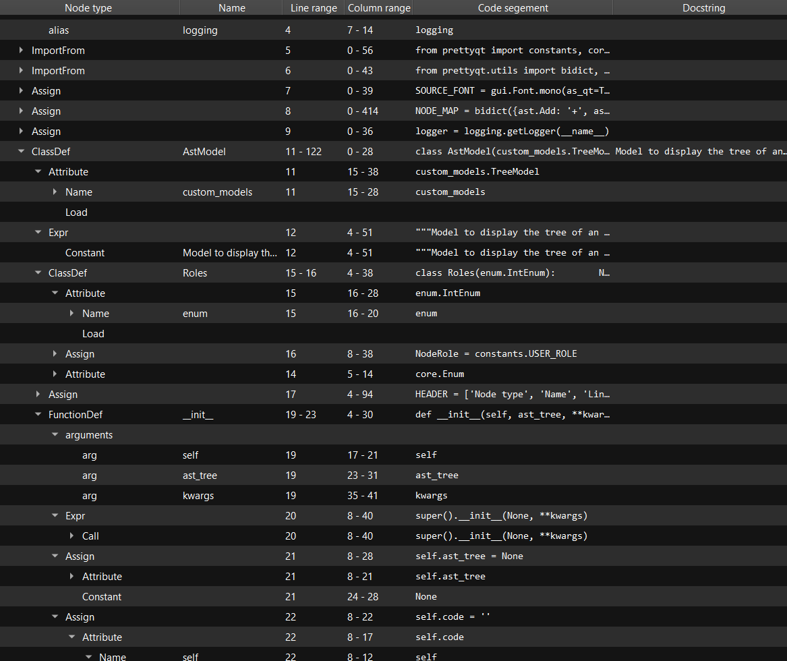

::: prettyqt.custom_models.AstModel

<figure markdown>
  
  <figcaption>AST model</figcaption>
</figure>

### Supports

`ast.AST`

### Additional roles

| Role                      | Data                     |
| --------------------------|--------------------------|
| `AstModel.Roles.NodeRole` | Ast Node                 |
