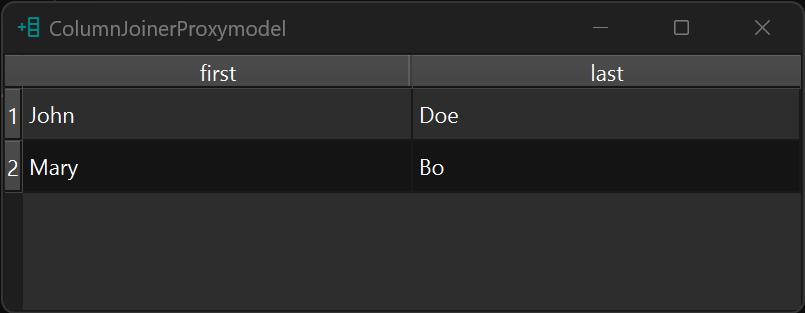
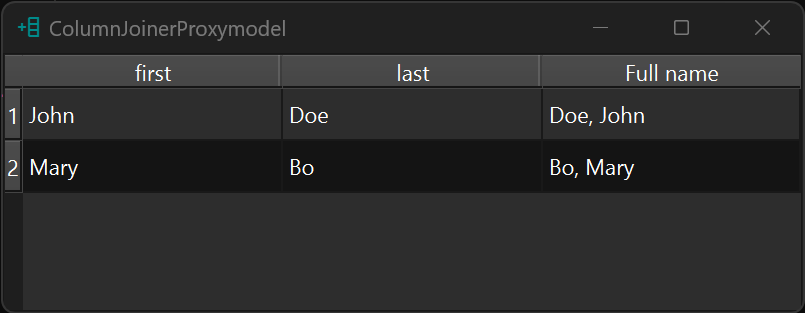

!!! Example "ColumnJoinerProxyModel"

    === "Without proxy"

        ```py
        data = dict(first=["John", "Mary"], last=["Doe", "Bo"])
        model = gui.StandardItemModel.from_dict(data)
        table = widgets.TableView()
        table.set_model(model)
        # table.proxifier.add_column(header="Full name", formatter="{1}, {0}")
        table.show()

        ```
        <figure markdown>
          
        </figure>

    === "With proxy"

        ```py
        data = dict(first=["John", "Mary"], last=["Doe", "Bo"])
        model = gui.StandardItemModel.from_dict(data)
        table = widgets.TableView()
        table.set_model(model)
        table.proxifier.add_column(header="Full name", formatter="{1}, {0}")
        table.show()
        ```
        <figure markdown>
          
        </figure>

::: prettyqt.custom_models.ColumnJoinerProxyModel
