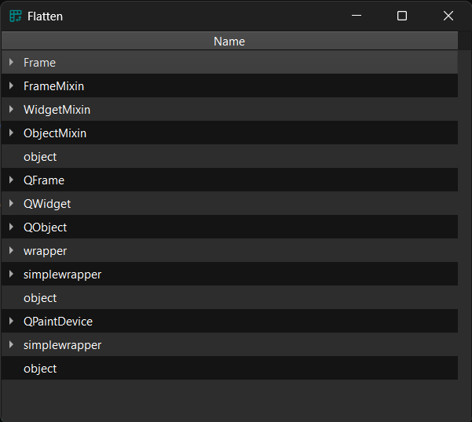

Proxy model to flatten a tree to appear like a table.

### Example

Original model:

```py
model = MyTreeModel()
table = widgets.TableView()
table.set_model(model)
table.show()
```

<figure markdown>
  
  <figcaption>Original table</figcaption>
</figure>


Flattened:

```py
table.proxifier.flatten()
table.show()
```
or
```py
proxy = custom_models.FlattenTreeProxyModel()
proxy.set_source_model(model)
table.set_model(proxy)
table.show()
```
<figure markdown>
  
  <figcaption>FlattenTreeProxyModel</figcaption>
</figure>

### API

::: prettyqt.custom_models.FlattenTreeProxyModel

### Qt Properties

| Qt Property         | Type    | Description                                 |
| --------------------|---------|---------------------------------------------|
| **flattening_mode** | `Enum`  | How to flatten the model                    |
| **display_mode**    | `Enum`  | How the label of the model should look like |
