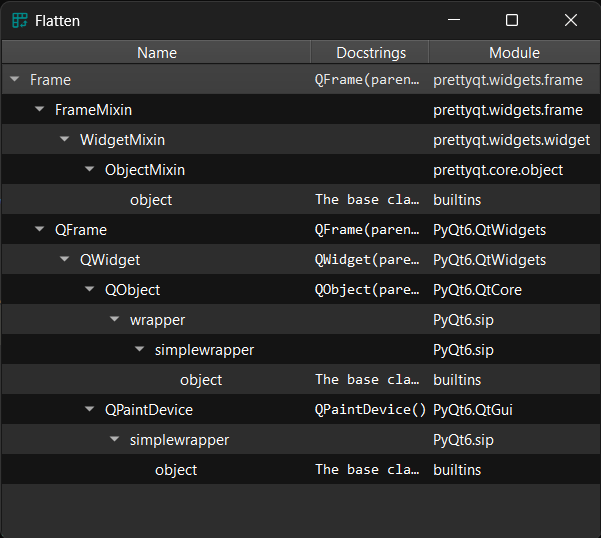
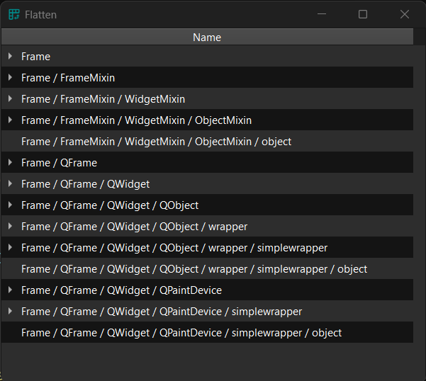
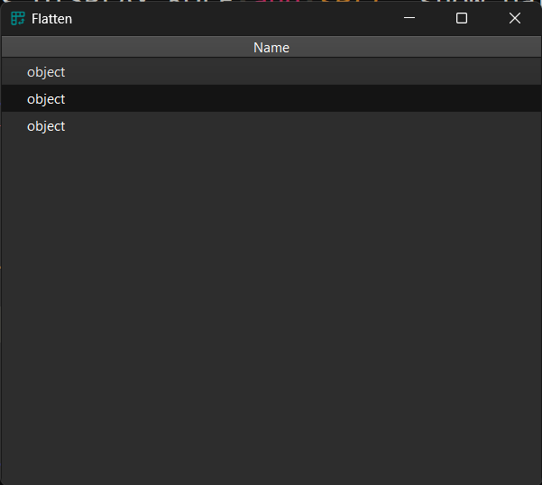

Proxy model to flatten a tree to appear like a table.

### Example

Original model:

!!! Example "MeltProxyModel"

    === "Without proxy"

        ```py
        table = widgets.TreeView()
        source_model = itemmodels.ParentClassTreeModel(widgets.Frame)
        table.set_model(source_model)
        # table.proxifier.flatten()
        ```
        <figure markdown>
          
        </figure>

    === "With proxy"

        ```py
        table = widgets.TreeView()
        source_model = itemmodels.ParentClassTreeModel(widgets.Frame)
        table.set_model(source_model)
        table.proxifier.flatten()
        ```
        <figure markdown>
          
        </figure>

    === "Path mode"

        ```py
        table = widgets.TreeView()
        source_model = itemmodels.ParentClassTreeModel(widgets.Frame)
        table.set_model(source_model)
        table.proxifier.flatten(show_path=True)
        ```
        <figure markdown>
          
        </figure>

    === "Leaves only mode"

        ```py
        table = widgets.TreeView()
        source_model = itemmodels.ParentClassTreeModel(widgets.Frame)
        table.set_model(source_model)
        table.proxifier.flatten(leaves_only=True)
        ```
        <figure markdown>
          
        </figure>

```py
table.proxifier.flatten()
# or
proxy = itemmodels.FlattenTreeProxyModel()
proxy.set_source_model(model)
table.set_model(proxy)
```

### API

::: prettyqt.itemmodels.FlattenTreeProxyModel

### Qt Properties

| Qt Property         | Type    | Description                                 |
| --------------------|---------|---------------------------------------------|
| **show_path**       | `bool`  | Show full path in first column              |
| **leaves_only**     | `bool`  | Only include tree leaves                    |
