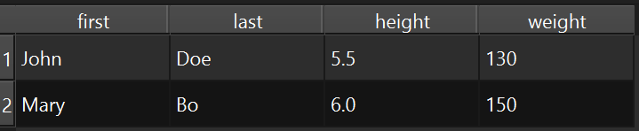
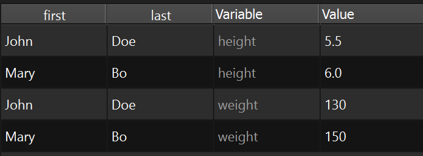

## MeltProxyModel

Proxy model to unpivot a table from wide to long format, as known from [pandas][https://pandas.pydata.org/docs/user_guide/reshaping.html#reshaping-melt].

### Example

```py
    app = widgets.app()
    data = dict(
        first=["John", "Mary"],
        last=["Doe", "Bo"],
        height=[5.5, 6.0],
        weight=[130, 150],
    )
    model = gui.StandardItemModel.from_dict(data)
    table = widgets.TableView()
    table.set_model(model)
    table.show()
```

<figure markdown>
  
  <figcaption>Original table</figcaption>
</figure>


```py
    table.proxifier.melt(id_columns=[0, 1])
    table.show()
```
or
```py
    proxy = custom_models.MeltProxyModel(id_columns=[0, 1])
    proxy.set_source_model(model)
    table.set_model(proxy)
    table.show()
```
<figure markdown>
  
  <figcaption>Proxied table</figcaption>
</figure>

### API

::: prettyqt.custom_models.MeltProxyModel

### Qt Properties

| Qt Property     | Type        | Description                             |
| ----------------|-------------| --------------------------------------- |
| **id_columns**: | `list[int]` | Columns to use as identifier variables  |
| **var_name**    | `str`       | Header for variable column              |
| **value_name**  | `str`       | Header for value column                 |
