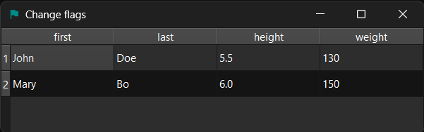
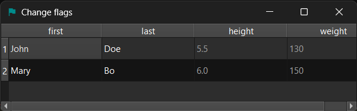

!!! Example "SliceChangeFlagsProxyModel"

    === "Without proxy"

        ```py
        table = widgets.TreeView()
        data = dict(
            first=["John", "Mary"],
            last=["Doe", "Bo"],
            height=[5.5, 6.0],
            weight=[130, 150],
        )
        source_model = gui.StandardItemModel.from_dict(data)
        table.set_model(source_model)
        # table.proxifier.change_flags(enabled=False)
        ```
        <figure markdown>
          
        </figure>

    === "With proxy"

        ```py
        table = widgets.TreeView()
        data = dict(
            first=["John", "Mary"],
            last=["Doe", "Bo"],
            height=[5.5, 6.0],
            weight=[130, 150],
        )
        source_model = gui.StandardItemModel.from_dict(data)
        table.set_model(source_model)
        table.proxifier.change_flags(enabled=False)
        ```
        <figure markdown>
          
        </figure>


Supports changing all ItemRoles by passing keyword arguments.

Possible keyword arguments:

* `selectable`: ItemFlag.ItemIsSelectable,
* `editable`: ItemFlag.ItemIsEditable,
* `drag_enabled`: ItemFlag.ItemIsDragEnabled,
* `drop_enabled`: ItemFlag.ItemIsDropEnabled,
* `user_checkable`: ItemFlag.ItemIsUserCheckable,
* `enabled`: ItemFlag.ItemIsEnabled,
* `auto_tristate`: ItemFlag.ItemIsAutoTristate,
* `never_has_children`: ItemFlag.ItemNeverHasChildren,
* `user_tristate`: ItemFlag.ItemIsUserTristate,


### Example

```py
model = MyModel()
table = widgets.TableView()
table.set_model(model)
table.proxifier[::2, 2:].change_flags(readable=False)
table.show()
```

or

```py
indexer = (slice(None, None, 2), slice(2, None))
proxy = custom_models.SliceChangeFlagsProxyModel(indexer=indexer, readable=False)
proxy.set_source_model(model)
table.set_model(proxy)
table.show()
```

Read more about [slices](https://docs.python.org/3/library/functions.html#slice).

### API

::: prettyqt.custom_models.SliceChangeFlagsProxyModel

### Qt Properties

| Qt Property         | Type       | Description                  |
| --------------------|------------| ---------------------------- |
| **column_slice**    | `slice`    | Slice for filtering columns  |
| **row_slice**       | `slice`    | Slice for filtering rows     |
| **flags_to_add**    | `ItemFlag` | Flags which are set to True  |
| **flags_to_remove** | `ItemFlag` | Flags which are set to False |

!!! note
    Due to Qt limitations, the Qt properties contain a list with 3 items instead of a slice.
