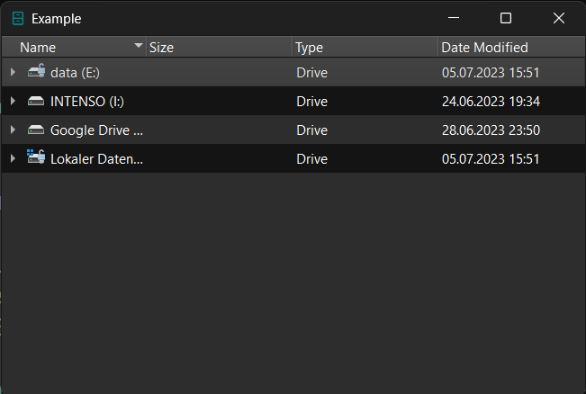

::: prettyqt.custom_models.SliceChangeIconSizeProxyModel

!!! Example "SliceChangeIconSizeProxyModel"

    === "Without proxy"

        ```py
        table = widgets.TreeView()
        source_model = widgets.FileSystemModel()
        ...
        table.set_model(source_model)
        # table.proxifier.change_icon_size(size=(30, 30))
        ```
        <figure markdown>
          
        </figure>

    === "With proxy"

        ```py
        table = widgets.TreeView()
        source_model = widgets.FileSystemModel()
        ...
        table.set_model(source_model)
        table.proxifier.change_icon_size(size=(30, 30))
        ```
        <figure markdown>
          
        </figure>

!!! note
    This is a slice proxy and can be selectively applied to a model.

### Example

```py
model = MyModel()
table = widgets.TreeView()
table.set_model(model)
table[0].proxify.change_icon_size(size=20)
table.show()
# or
proxy = custom_models.SliceFilterProxyModel(indexer=0, size=20)
proxy.set_source_model(model)
table.set_model(proxy)
table.show()
```


### Qt Properties

| Qt Property         | Type        | Description                  |
| --------------------|-------------| ---------------------------- |
| **column_slice**    | `slice`     | Slice for filtering columns  |
| **row_slice**       | `slice`     | Slice for filtering rows     |
| **icon_size**       | `core.QSize`| Icon size for DecorationRole |

!!! note
    Due to Qt limitations, the Qt properties contain a list with 3 items instead of a slice.
