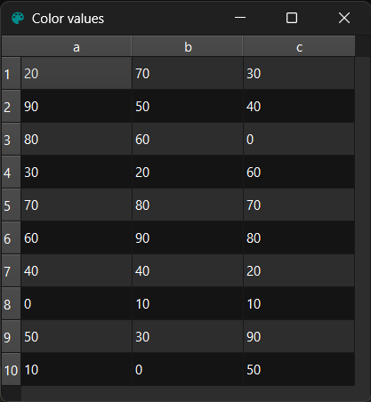
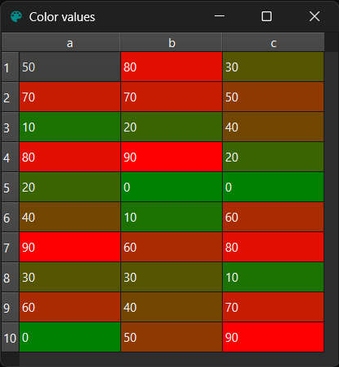

!!! Example "SliceColorCategoriesProxyModel"

    === "Without proxy"

        ```py
        val_range = range(0, 100, 10)
        data = dict(
            a=random.sample(val_range, k=10),
            b=random.sample(val_range, k=10),
            c=random.sample(val_range, k=10),
        )
        model = gui.StandardItemModel.from_dict(data)
        table = widgets.TableView()
        table.set_model(model)
        # table.proxifier[:, :].color_values()
        ```
        <figure markdown>
          
        </figure>

    === "With proxy"

        ```py
        val_range = range(0, 100, 10)
        data = dict(
            a=random.sample(val_range, k=10),
            b=random.sample(val_range, k=10),
            c=random.sample(val_range, k=10),
        )
        model = gui.StandardItemModel.from_dict(data)
        table = widgets.TableView()
        table.set_model(model)
        table.proxifier[:, :].color_values()
        ```
        <figure markdown>
          
        </figure>


::: prettyqt.itemmodels.SliceColorCategoriesProxyModel


### Qt Properties

| Qt Property         | Type                     | Description                        |
| --------------------|--------------------------| -----------------------------------|
| **highlight_mode**  | `str`                    | Highlighting mode                  |
| **highlight_color** | `gui.QColor`             | Color to use for highlighted cells |
| **highlight_role**  | `constants.ItemDataRole` | Role to use for comparing          |
