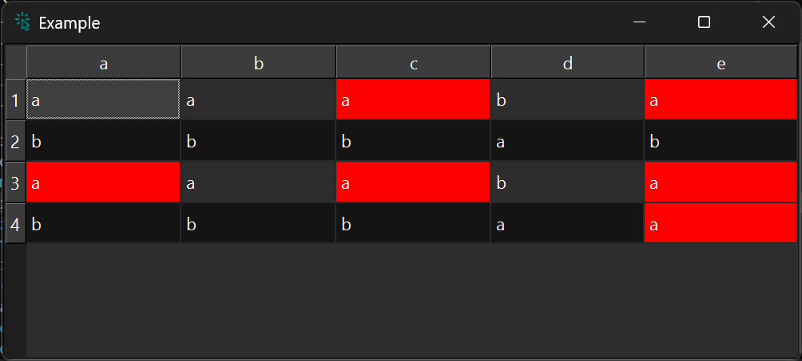

!!! Example "ColumnJoinerProxyModel"

    === "Without proxy"

        ```py
        dct = dict(
            a=["a", "b", "a", "b"],
            b=["a", "b", "a", "b"],
            c=["a", "b", "a", "b"],
            d=["b", "a", "b", "a"],
            e=["a", "b", "a", "a"],
        )
        model = gui.StandardItemModel.from_dict(dct)
        table = widgets.TableView()
        table.set_model(model)
        # apply proxy to every 2nd column
        # table.proxifier[:, ::2].highlight_current(mode="column")
        ```
        <figure markdown>
          
        </figure>

    === "Row mode"

        ```py
        dct = dict(
            a=["a", "b", "a", "b"],
            b=["a", "b", "a", "b"],
            c=["a", "b", "a", "b"],
            d=["b", "a", "b", "a"],
            e=["a", "b", "a", "a"],
        )
        model = gui.StandardItemModel.from_dict(dct)
        table = widgets.TableView()
        table.set_model(model)
        # apply proxy to every 2nd column
        table.proxifier[:, ::2].highlight_current(mode="row")
        ```
        <figure markdown>
          
        </figure>

    === "Column mode"

        ```py
        dct = dict(
            a=["a", "b", "a", "b"],
            b=["a", "b", "a", "b"],
            c=["a", "b", "a", "b"],
            d=["b", "a", "b", "a"],
            e=["a", "b", "a", "a"],
        )
        model = gui.StandardItemModel.from_dict(dct)
        table = widgets.TableView()
        table.set_model(model)
        # apply proxy to every 2nd column
        table.proxifier[:, ::2].highlight_current(mode="column")
        ```
        <figure markdown>
          
        </figure>

    === "All mode"

        ```py
        dct = dict(
            a=["a", "b", "a", "b"],
            b=["a", "b", "a", "b"],
            c=["a", "b", "a", "b"],
            d=["b", "a", "b", "a"],
            e=["a", "b", "a", "a"],
        )
        model = gui.StandardItemModel.from_dict(dct)
        table = widgets.TableView()
        table.set_model(model)
        # apply proxy to every 2nd column
        table.proxifier[:, ::2].highlight_current(mode="all")
        ```
        <figure markdown>
          
        </figure>


### API

::: prettyqt.custom_models.SliceHighlightCurrentProxyModel

### Qt Properties

| Qt Property         | Type                     | Description                        |
| --------------------|--------------------------| -----------------------------------|
| **highlight_mode**  | `str`                    | Highlighting mode                  |
| **highlight_color** | `gui.QColor`             | Color to use for highlighted cells |
| **highlight_role**  | `constants.ItemDataRole` | Role to use for comparing          |
