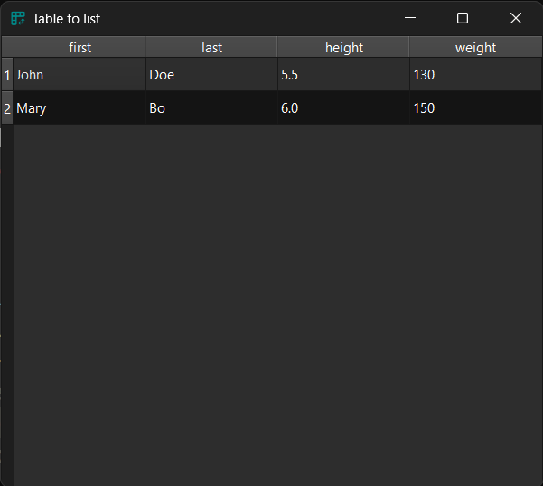
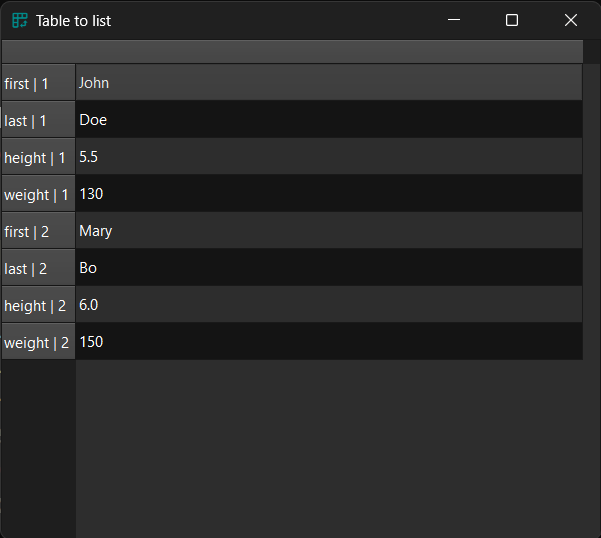

!!! Example "TableToListProxyModel"

    === "Without proxy"

        ```py
        data = dict(
            first=["John", "Mary"],
            last=["Doe", "Bo"],
            height=[5.5, 6.0],
            weight=[130, 150],
        )
        model = gui.StandardItemModel.from_dict(data)
        table = widgets.TableView()
        table.set_model(model)
        # table.proxifier.to_list()
        table.show()

        ```
        <figure markdown>
          
        </figure>

    === "With proxy"

        ```py
        data = dict(
            first=["John", "Mary"],
            last=["Doe", "Bo"],
            height=[5.5, 6.0],
            weight=[130, 150],
        )
        model = gui.StandardItemModel.from_dict(data)
        table = widgets.TableView()
        table.set_model(model)
        table.proxifier.to_list()
        table.show()
        ```
        <figure markdown>
          
        </figure>

::: prettyqt.itemmodels.TableToListProxyModel

### Qt Properties

| Qt Property          | Type    | Description                      |
| ---------------------|---------|----------------------------------|
| **header_title**     | `str`   | Header for the resulting column  |
