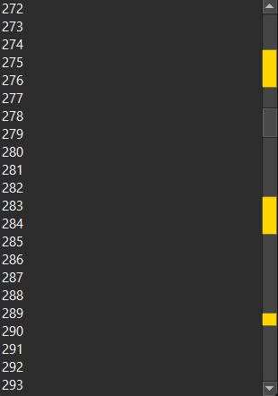

ScrollBar which can highlight user-chosen segments.


``` py
    widget = widgets.PlainTextEdit("\n".join(str(i) for i in range(1000)))
    widget.v_scrollbar = AnnotatedScrollBar(constants.VERTICAL)
    widget.v_scrollbar.set_annotations([(10, 20), (50, 60), (82, 85)])
```

<figure markdown>
  
  <figcaption>Annotated ScrollBar</figcaption>
</figure>


### API

::: prettyqt.custom_widgets.AnnotatedScrollBar

### Qt Properties

| Qt Property          | Type                    | Description                                |
| ---------------------|-------------------------| ------------------------------------------ |
| **annotation_color** | `gui.QColor`            | Highlight color to use                     |
| **annotations**      | `list[tuple[int, int]]` | List of segments to highlight              |
| **document_length**  | `int`                   | Base length for the segments (default 100) |
