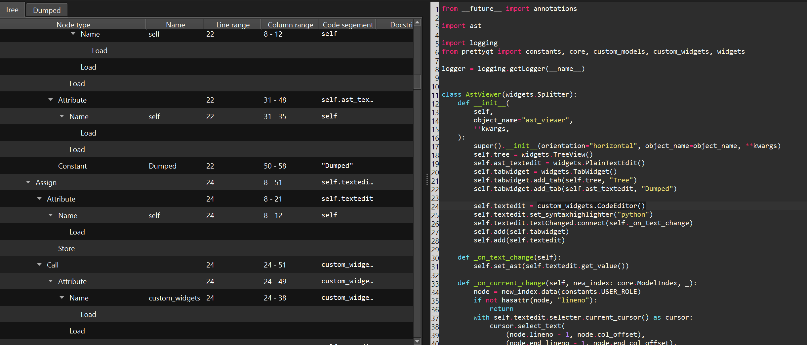

## AstViewer

Widget which displays an AST Tree next to the corresponding source code.
Selecting a node in the tree will highlight the corresponing text section in source.

``` py
    widget = custom_widgets.AstViewer()
    widget.show()
```

<figure markdown>
  
  <figcaption>AstViewer widget</figcaption>
</figure>
