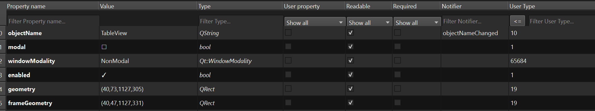

## FilterHeader

A HeaderView subclass which includes LineEdits / Dropdowns with filter possibilities.
When setting the header view on an ItemView, a proxy model will be created which is linked to the filter widgets.
The correct filter widget is automatically inferred from the content of the columns.

So basically everything that needs to be done is the following:

```py
    model = MyModel()
    widget = widgets.TableView()
    widget.set_model(model)
    widget.h_header = custom_widgets.FilterHeader() # same as setHorizontalHeader()
```

and you will get filter capabilities for your table.

<figure markdown>
  
  <figcaption>FilterHeader widget</figcaption>
</figure>
