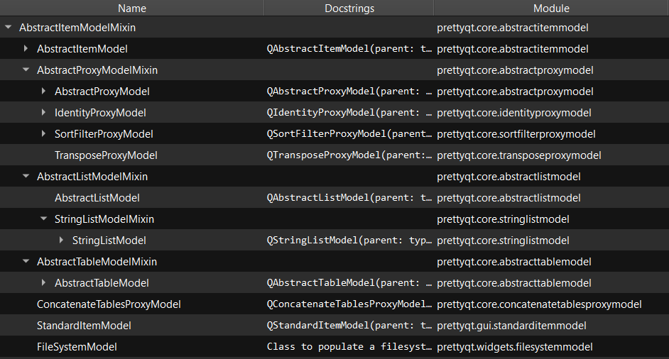
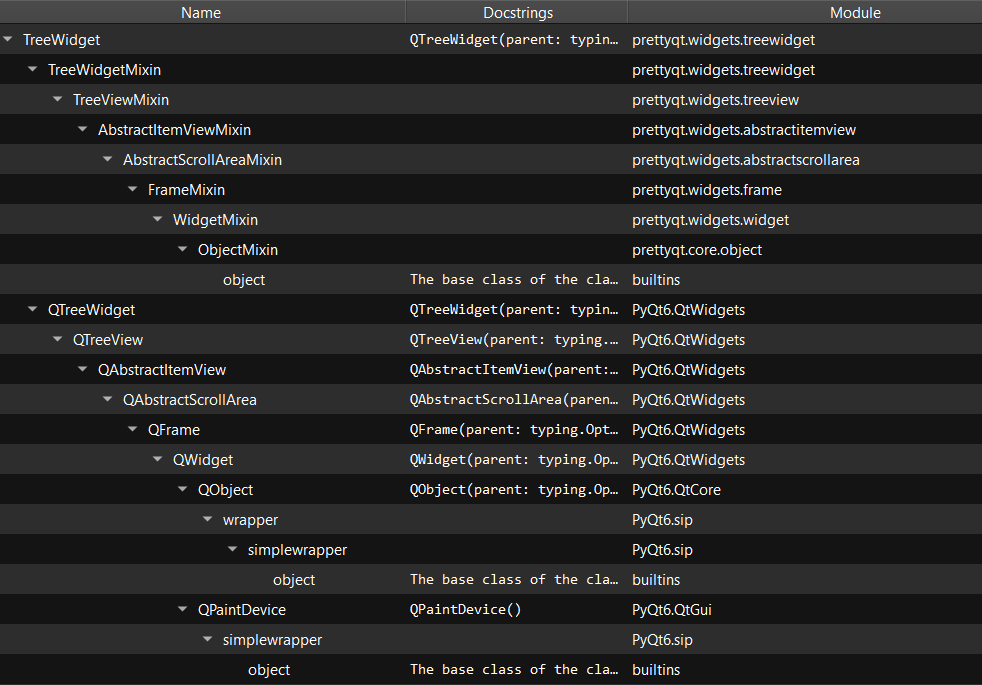
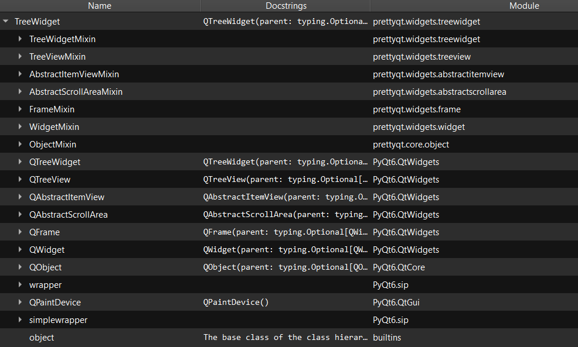

---
hide:
  - navigation
---
# PrettyQt: Pythonic layer on top of PyQt6 / PySide6
[](https://pypi.org/project/prettyqt/)
[](https://pypi.org/project/prettyqt/)
[](https://codecov.io/gh/phil65/PrettyQt)
[](https://github.com/psf/black)
[](https://pyup.io/repos/github/phil65/PrettyQt/)

## What is it?

**PrettyQt** is a Python package that provides a pythonic layer on top of the GUI frameworks PyQt6 / PySide6.

## Main Features
  - Subclasses for a large part of the Qt classes, enriched with helper and \__dunder__ methods to give a feel of a native GUI library.
  - more than 80 pre-defined widgets and layouts for common use cases
  - [more than 30 ItemModels for different data types](models.md)
  - [more than 25 general-purpose proxy models](proxies.md)
  - [10 ItemDelegates for different purposes](delegates.md)
  - [20 different validators](validators.md)
  - Integration with pandas / numpy.
  - much, much more.

PrettyQt basically is a wrapper for the whole Qt API (either on top of PySide6 or PyQt6 bindings).
Perhaps it can be seen as a small Python equivalent of the KDE framework.

A large part of the library consists of a tree of mixins, with one mixin for each Qt class.
These mixins also inherit from each other and are applied to the Qt classes.
That way each class gets all helper methods from all sub-mixins.

Example: The class "TreeView" inherits from original Qt Class "QTreeView" and gets helper methods
from "TreeViewMxin", "AbstractItemViewMixin", "AbstractScrollAreaMixin",
"FrameMixin", "WidgetMixin" and "ObjectMixin".

To illustrate this, we will use some of our included models:


!!! Example "Class hierarchy example"

    === "Subclass tree"

        ```py
        from prettyqt import custom_models, widgets

        app = widgets.app()
        widget = widgets.TreeView()
        model = custom_models.SubClassTreeModel(core.AbstractItemModelMixin)
        widget.set_model(model)
        widget.show()
        ```

        <figure markdown>
          
          <figcaption>AbstractitemModelMixin subclasses</figcaption>
        </figure>

    === "Parentclass tree"

        ```py
        from prettyqt import custom_models, widgets

        app = widgets.app()
        widget = widgets.TreeView()
        model = custom_models.ParentClassTreeModel(widgets.TreeWidget)
        widget.set_model(model)
        widget.show()
        ```

        <figure markdown>
          
          <figcaption>TreeWidget parent classes</figcaption>
        </figure>

    === "MRO tree"

        ```py
        from prettyqt import custom_models, widgets

        app = widgets.app()
        widget = widgets.TreeView()
        model = custom_models.ParentClassTreeModel(widgets.TreeWidget, mro=True)
        widget.set_model(model)
        widget.show()
        ```

        <figure markdown>
          
          <figcaption>TreeWidget MRO</figcaption>
        </figure>


Main objective is to make Qt feel "pythonic". Qt is originally a C++ Framework,
and using it can be quite cumbersome for Python developers. (very restrictive when it comes to types,
very OOP-centric, lot of enum use, snakeCase naming etc.) PrettyQt aims to improve this by:

- adding more powerful methods to the classes, which accept more types and have more options (in form of keyword arguments)
- doing conversions for method parameters to lessen the strictness for types. (Example: points, sizes and rectangles can also be passed to Qt methods as tuples.)
- raising Exceptions or returning `None` instead of returning `-1` or invalid objects.
- all enum getters/setters also work with strings. Everything typed with Literals for an excellent IDE experience. (Example: )
- adding a lot of \__dunder__ methods to the classes to make them behave like good python citizens.


The minimum supported python version is 3.10. Since large parts of the library are dealing with type conversions, the match-case statement is essential, therefore makin it impossible to use older Python versions.
The minimum supported Qt version is 6.5, since it is the first Qt Version which is up-to-par featurewise with Qt5.

The aim is to support the last two released Python versions as well as keeping support for the last Qt LTS release.

Apart from the 3D related modules (Qt3D, QtDataVizualization), QtXml and QtSql,
almost every class from Qt is covered.

## Covered Qt modules

| Qt Module           | PrettyQt module            |
|---------------------|----------------------------|
| QtBluetooth         | [prettyqt.bluetooth](bluetooth.md)         |
| QtCharts            | [prettyqt.charts](charts.md)            |
| QtCore              | [prettyqt.core](core.md)              |
| QtDesigner          | [prettyqt.designer](designer.md)          |
| QtGui               | [prettyqt.gui](gui.md)               |
| QtLocation          | [prettyqt.location](location.md)          |
| QtMultimedia        | [prettyqt.multimedia](multimedia.md)        |
| QtMultimediaWidgets | [prettyqt.multimediawidgets](multimediawidgets.md) |
| QtNetwork           | [prettyqt.network](network.md)           |
| QtOpenGLWidgets     | [prettyqt.openglwidgets](openglwidgets.md)     |
| QtPdf               | [prettyqt.pdf](pdf.md)               |
| QtPdfWidgets        | [prettyqt.pdfwidgets](pdfwidgets.md)        |
| QtPositioning       | [prettyqt.positioning](positioning.md)       |
| QtPrintSupport      | [prettyqt.printsupport](printsupport.md)      |
| QtQml               | [prettyqt.qml](qml.md)               |
| QtHelp              | [prettyqt.qthelp](qthelp.md)            |
| QtQuick             | [prettyqt.quick](quick.md)             |
| QtQuickWidgets      | [prettyqt.quickwidgets](quickwidgets.md)      |
| QScintilla          | [prettyqt.scintilla](scintilla.md)         |
| QtScXml             | [prettyqt.scxml](scxml.md)             |
| QtSpatialAudio      | [prettyqt.spatialaudio](spatialaudio.md)      |
| QtStateMachine      | [prettyqt.statemachine](statemachine.md)      |
| QtSvg               | [prettyqt.svg](svg.md)               |
| QtSvgWidgets        | [prettyqt.svgwidgets](svgwidgets.md)        |
| QtTest              | [prettyqt.test](test.md)              |
| QtTextToSpeech      | [prettyqt.texttospeech](texttospeech.md)      |
| QtWebChannel        | [prettyqt.webchannel](webchannel.md)        |
| QtWebEngineCore     | [prettyqt.webenginecore](webenginecore.md)     |
| QtWebEngineWidgets  | [prettyqt.webenginewidgets](webenginewidgets.md)  |
| QtWidgets           | [prettyqt.widgets](api/widgets.md)           |


[Read more](general.md) about the general API design.

Apart from the mentioned mixin tree and the corresponding classes, this library also
contains a lot of custom widgets, delegates, eventfilters, validators,
syntaxhighlighters, layouts, models, proxy models and much more.

Converting to PrettyQt should be very straightforward since the original behaviour of the
Qt classes didnt change for the largest parts and all methods from base Qt modules
are still available. (There might be a few constructors with slightly different behaviour though.)

Interested? Take a look at the documentation! (even though it totally sucks in its current state.)

## Where to get it
The source code is currently hosted on GitHub at:
https://github.com/phil65/PrettyQt

The latest released version are available at the [Python
package index](https://pypi.org/project/prettyqt).

```sh
# or PyPI
pip install prettyqt
```

## Required dependencies

* [bidict](https://pypi.org/project/bidict)
* [pygments](https://pypi.org/project/pygments)
* [qstylizer](https://pypi.org/project/qstylizer)
* [typing_extensions](https://pypi.org/project/typing_extensions)
* [pyside6](https://pypi.org/project/pyside6) or [pyqt6](https://pypi.org/project/pyqt6)\*

\*Note: Only Qt 6.5+ is supported.

## Optional dependencies

* [orjson](https://pypi.org/project/orjson)
* [numpy](https://pypi.org/project/numpy)
* [ipython](https://pypi.org/project/ipython)
* [qtconsole](https://pypi.org/project/qtconsole)
* [pillow](https://pypi.org/project/pillow)
* [fsspec](https://pypi.org/project/fsspec)
* [docutils](https://pypi.org/project/docutils)


## Installation from sources

This project uses poetry for dependency management and packaging. Install this first.
In the `prettyqt` directory (same one where you found this file after
cloning the git repo), execute:

```sh
poetry install
```

## License
[MIT](LICENSE)

## Contributing to prettyqt [](https://www.codetriage.com/phil65/prettyqt)

All contributions, bug reports, bug fixes, documentation improvements, enhancements, and ideas are welcome.

Or maybe through using PrettyQt you have an idea of your own or are looking for something in the documentation and thinking ‘this can be improved’...you can do something about it!
